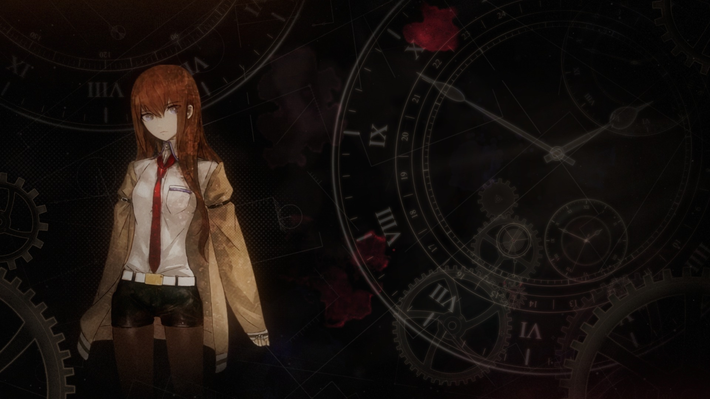
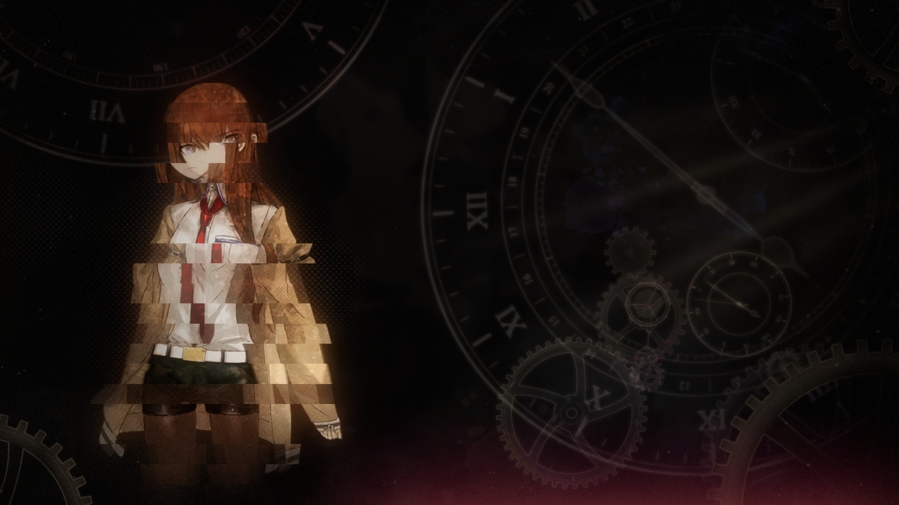
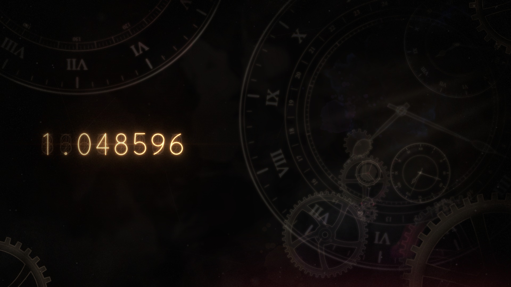
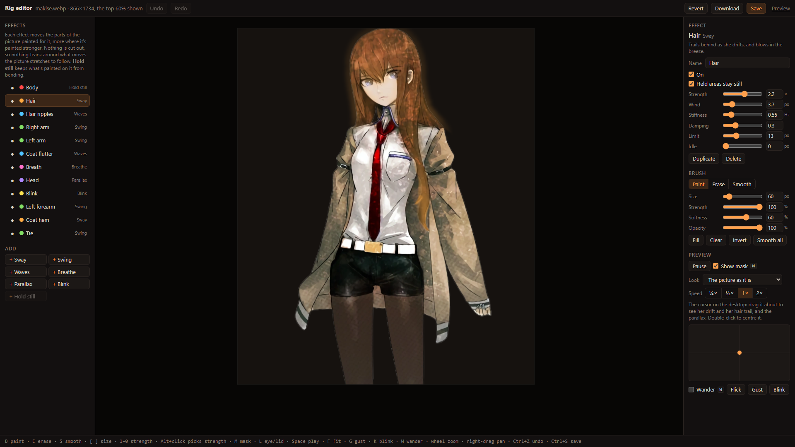

# Wallpaper Rig

A *Steins;Gate* wallpaper (the Divergence Meter) and the rig behind it. An animated wallpaper for [Wallpaper Engine](https://www.wallpaperengine.io/)
and [Lively](https://www.rocksdanister.com/lively/). Makise Kurisu, or a glowing nixie
meter, stands among slowly turning clocks and gears over a faint drafting drawing that
grows like a crystal, with living ink, drifting light, dust and film grain on top. Every
so often the worldline shifts.

Everything is drawn in code (HTML canvas and WebGL, no build step) apart from the Makise
artwork, which is official art and isn't included in this repo: a drawn placeholder stands
in until you add your own (see below).


| | |
| --- | --- |
|  |  |
|  |  |

## Highlights

- **A rigged picture, no cutting.** Hair sways, arms swing in the jacket, the tie moves,
  she breathes and blinks, all from one flat image. I reverse engineered how Wallpaper
  Engine animates a picture (Shake, Water waves, Depth parallax, puppet-warp spring bones)
  into a single WebGL pass: each effect pushes the picture's pixels by an amount painted
  into a mask, so nothing opens a gap.
- **A rig editor.** Paint the masks, tune the springs and test the motion in the browser
  ([`tools/rig.html`](tools/rig.html)).
- **Nixie meter** showing the time, the date or a worldline, with unlit cathodes and bloom.
- **Worldline shifts** every 20–60 minutes: the digits scramble, the clocks spin, light
  flares. Click the desktop to trigger one.
- **Living ink, light and schematics.** Ink blots drift and dissolve, light shafts pan
  across the scene, and the drafting drawing grows and redraws itself.
- **Cheap to run.** Static layers are baked once; capped at 30 fps; stops when hidden.

## Install

**Wallpaper Engine**: in Steam, right-click Wallpaper Engine → **Manage** → **Browse local
files**, copy this repo's `wallpaper` folder into `projects\myprojects`, restart Wallpaper
Engine and pick it under **Installed**.

**Lively**: run `python tools/package.py`, then drag `dist/divergence-meter.zip` onto Lively.

For parallax and click-to-shift, let the wallpaper receive mouse input.

## Settings

| Setting | Options |
| --- | --- |
| Centrepiece | Makise, or Nixie meter: time, date, worldline |
| Glow strength / size, Ink, Texture, Schematic | 0–100 (50 as designed) |
| Makise motion, Cursor parallax, Worldline shifts | On / Off |

## Using your own picture

Drop a `makise.webp`, `.png` or `.jpg` into `wallpaper/img/` (a transparent cut-out
looks best). Without one a drawn placeholder stands in. See
[docs/details.md](docs/details.md#using-your-own-picture) for placement and rigging.

## Development

```bash
node tools/serve.js
```

Open <http://localhost:5173/> for the preview (resolutions, settings, shift and click
buttons, time speed-up, PNG capture), or <http://localhost:5173/tools/rig.html> for the
rig editor. `node tools/test.js` runs the behaviour checks, including that the rig never
moves what is held still or folds the picture.

| Path | What it is |
| --- | --- |
| `wallpaper/` | The wallpaper itself (`js/` has the scene, nixie, ink, schematics, atmosphere and the WebGL `rig.js`) |
| `tools/` | Preview, rig editor, test script, recorder, packager |
| `workshop/` | Steam Workshop text and screenshots |
| `docs/details.md` | The full write-up: how everything behaves, the rig and editor, URL parameters, code layout |

---

Unofficial fan work. *Steins;Gate* belongs to its respective owners.
