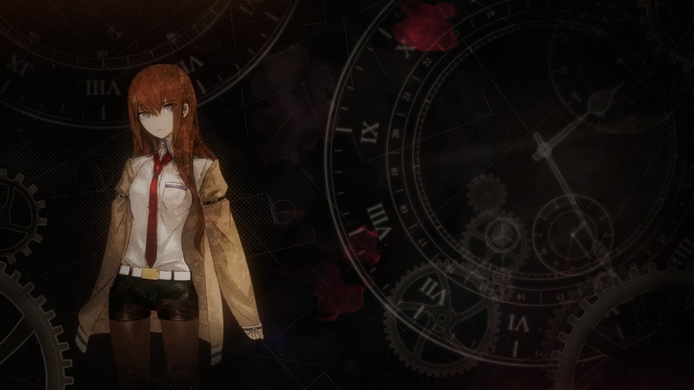

# Wallpaper Rig: the full details

An animated desktop wallpaper: Makise Kurisu, or the glowing digits of a nixie meter
(with their faint unlit cathodes and honeycomb, but no glass), surrounded by slowly
turning clocks, gears and an escapement over a faint drafting drawing that slowly
grows and redraws itself, with living ink, light that pans across the scene, wandering
dust, faint smoke and film grain over the top.
The nixie meter shows the time, the date or a worldline. Every so often the worldline
shifts: the digits scramble (or the picture glitches), the clocks spin, and everything
settles.

Everything is drawn in code (HTML canvas, no build step), apart from the Makise
picture in `wallpaper/img/` (see [Using your own picture](#using-your-own-picture));
without it, a drawn placeholder stands in.



## Install

### Wallpaper Engine

1. In Steam, right-click **Wallpaper Engine** → **Manage** → **Browse local files**.
2. Open `projects\myprojects` and copy this repo's `wallpaper` folder into it
   (rename it to something like `divergence-meter` if you like).
3. Start (or restart) Wallpaper Engine. The wallpaper appears under **Installed**.
   Select it and apply it to each monitor you want.
4. The settings appear in the panel on the right.

If moving the mouse or clicking does nothing, check that Wallpaper Engine is set to
pass mouse input to wallpapers.

### Lively Wallpaper

1. Build the package (needs Python 3):

   ```bash
   python tools/package.py
   ```

   This writes `dist/divergence-meter.zip`.
2. In Lively, click **+** (Add Wallpaper) and choose the zip, or drag the zip onto the
   Lively window.
3. Open the wallpaper's **Customise** panel for the settings.

For the parallax and click-to-shift to work, set Lively's wallpaper input to the mouse
in Lively's settings.

## Settings

| Setting | Options | Default |
| --- | --- | --- |
| Centrepiece | Makise Kurisu (a picture), Nixie meter: time (`HH.MM.SS`, 24-hour), date (`YY.MM.DD`) or worldline | Makise Kurisu |
| Glow strength, Glow size | 0–100: the centrepiece's glow (Makise's backlight, or the digits' bloom) and how far it spreads | 50 |
| Ink strength | 0–100 | 50 |
| Texture strength | 0–100: the mottled backdrop, the halftone patches and the worn print over everything | 50 |
| Schematic strength | 0–100: the faint drafting drawing behind everything (0 turns it off) | 50 |
| Makise motion | On, Off | On |
| Cursor parallax | On, Off | On |
| Worldline shifts | On, Off | On |

## Using your own picture

The Makise centrepiece shows the first of these that exists in `wallpaper/img/`:
`makise.webp`, `makise.png`, `makise.jpg`. Without one, `placeholder.webp` (a drawn
silhouette) stands in. If no picture loads at all, the nixie meter takes its place.

- A picture with a transparent background (a cut-out character) looks best. A plain
  rectangular picture works too: its edges are feathered into the dark. (An entry
  marked `cutout: true` in `SOURCES` is only faded at its foot, so its head stays whole.)
- Any size: it is fitted into the left of the frame, standing on the bottom edge, with
  its lower part fading out. It is toned down toward the scene's light, so it sits in
  the shadows, with a faint backlight.
- `makise.webp` is shown from the top down to between the thighs and knees (`crop: 0.6`
  in `SOURCES` in `wallpaper/js/portrait.js`); a `.png` or `.jpg` is shown whole.
- To move or resize it, change `BOX` at the top of `portrait.js` (design pixels on a
  2560×1440 frame: centre, foot, maximum width and height, feathering, fade).

### Bringing her to life

`makise.webp` is rigged, so only the parts that should move do:

- her **hair** sways: a little all over, more on the bangs, most down the long lock and
  the loose ends, hardly at all where it rests on her shoulders. It swings in a breeze
  that now and then gusts, trails behind when she drifts with the cursor, and ripples;
- her **arms** swing gently from the shoulders inside her **jacket**, whose loose cuffs
  and hem, hanging away from her body, flutter;
- her **left arm** (on the right) drifts about on its own, slowly, and bends a little at
  the elbow, its forearm and hand lagging the shoulder, never dragging the coat it lies
  against;
- the **jacket round her legs** sways in the breeze and trails behind as she drifts,
  free toward the hem and still at the waist;
- her **tie** sways a little from its knot;
- she **blinks** now and then, at random, sometimes twice: for a frame or two her upper
  lashes come down onto her lower lids, with her eyelids, shaded under her hair, above;
- she **breathes**, softly: her head and shoulders rise a pixel or so;
- her **head** sits a little nearer than the rest, so it shifts a touch more with the cursor.

Her face, shirt, belt, shorts and legs never bend.

It works the way Wallpaper Engine animates a picture with its Shake, Water waves and
Depth parallax effects and its puppet warp's spring bones: nothing is cut out of the
picture and nothing has to be filled in behind. Each effect pushes the pixels of the one
picture by as much as was painted for it, and the picture around a moving part stretches
and squeezes to follow over the soft edge of what was painted. So nothing can open a gap,
nothing is dragged along by a lock of hair, and what is painted **Hold still** stays put.
The blink is the one exception, and doesn't follow Wallpaper Engine (its creators blink
with Shake, which looks each eye's colour up further up the picture; above Makise's eyes
is her hair, so that pulled hair down into them). It has two masks: each eye, and inside
it the upper lid, the dark lash. Blinking, the lid comes down over the eye, in each column
until its lower edge reaches the bottom of the eye, and where it was or has passed shows
her skin, taken from a spot on her cheek and shaded a little under her hair.

Or the shut eyes can be drawn by hand instead: `makise-lids.png` beside `makise.webp`,
the same size as it (866 × 1734), transparent everywhere but the shut eyes. For as long
as each blink lasts (its **Length**, 0.16 s: about ten frames) it simply shows over her,
whole, with nothing in between, and moves with her as she breathes and turns. To make it,
open `makise.webp` in a paint program, draw the shut lids (the dark upper lash, and skin
over the eye above it) on a new layer, hide the picture and export just that layer as a
PNG with transparency. While it's there, the blink's eye and lid masks aren't used; take
it away and the painted lid comes down as before.

The rig is `makise-rig.js` beside `makise.webp`, with the masks it names
(`makise-rig-0.png` and so on, three masks to a picture: red, green and blue, at half
the picture's size; a blink has two). A picture's rig is always `<its name>-rig.js` beside it, and it
says the size of the picture it was made for, so a rig never lands on another picture.

#### The rig editor

Paint how she moves, much as you paint effect masks in Wallpaper Engine:

```bash
node tools/serve.js
```

and open <http://localhost:5173/tools/rig.html> (or **Rig editor** in the preview).

- On the left, her **effects**. Click one to paint it and set it up, ● to switch it off
  and on; add more below:
  - **Sway**: trails behind as she drifts and blows in the breeze, on a spring
    (strength, wind, stiffness, damping, limit, and idle: how far it drifts about on its
    own, slowly, as if she shifted it);
  - **Swing**: the same, but turning about a pivot you drag onto the picture (an arm in
    its sleeve; a forearm about its elbow, on top of the arm's own swing);
  - **Waves**: ripples running across it (strength, length, speed, direction, how much
    stronger in gusts, how far out of step neighbouring strands run);
  - **Breathe**: rises and falls with each breath (strength, direction, period);
  - **Parallax**: shifts with the cursor, as if nearer (or, with a depth below 0, farther);
  - **Blink**: shuts the eyes now and then (every so many seconds on average, length,
    how often twice, direction, and shade: how much darker the shut lid is under her
    hair). It has two masks, shown together, and **Eye** and **Lid** (or L) choose which
    you paint:
    - the **Eye** (yellow): all of each eye, from the top of its upper lash to its lower
      lid (taking in the lower lid line, so the shut lash covers it), leaving out any hair
      that hangs in front of it;
    - the **Lid** (blue), inside it: the dark upper lash, a px or so beyond it.

    Blinking, the lid comes down over the eye: in each column, until its lower edge
    reaches the bottom of the eye there, so the shut lash follows the curve of the lower
    lid. Where the lid was or has passed shows the colour at its **skin spot**, which you
    drag onto bare skin (shaded warm, most at the top). The edges are where the masks are
    half painted, so paint them firmly (the lid a little beyond the lash) rather than
    faded. An eye can be up to about 90 px from the top of its lid to its bottom. It pays
    Hold still no heed. Effects with the same timing blink together, so paint both eyes in
    one;
  - **Hold still**: what must never bend. Sway, swing and waves leave it be; breathing
    and parallax still carry it, whole. Each effect can be told to ignore it.
- Paint where the chosen effect works: brighter is stronger. **Paint**, **Erase** and
  **Smooth** brushes, with size, strength, softness and opacity; fill, clear, invert or
  smooth the whole mask. Its mask shows over the picture, in its colour, moving with it;
  the picture holds still while you paint, so the brush lands where you see it.
- It moves on the page just as it will on the desktop: drag the cursor pad to see her
  drift and her hair trail and the parallax, **Wander** to have the cursor wander about,
  **Flick** to throw it across, **Gust** for a gust of wind, **Blink** to blink now, at ¼×
  to 2× speed.
- **Save** writes the rig beside the picture (only through `tools/serve.js`; elsewhere
  **Download** gives you the files in a zip). Undo and redo go back 100 steps.

Keys: B paint, E erase, S smooth, `[` `]` brush size (with Shift, softness), 1–9 and 0
strength, Alt+click picks up the strength under the brush, M mask, L a blink's eye or lid,
Space play, F fit, G gust, K blink, W wander, ↑ ↓ another effect, wheel zoom, right-drag
pan, Ctrl+Z undo, Ctrl+Shift+Z redo, Ctrl+S save.

Soft edges matter: where a mask goes from moving to still, the picture between stretches,
so the soft edge should be at least as wide as the part moves far (a hard edge folds
the picture over itself, which shows as a seam). `node tools/test.js` checks the rig beside
`makise.webp` for that: at its strongest, nothing held moves and nothing folds.

It all runs on the GPU (WebGL, `wallpaper/js/rig.js`). Without WebGL, or where the
browser treats a local picture as foreign (it can under `file://`), the picture is drawn
whole and holds still apart from floating.

The starting rig was made by `python tools/rigmap.py` from the colours of the hair,
jacket and tie inside regions placed (and, for the long lock and the left forearm, traced)
by hand for this picture, and from each eye's lash and the bottom of the eye, measured
column by column; then
the editor takes over. Running `rigmap.py` again starts the rig over (the hair masks
shipped now were touched up in the editor since). For another picture, start a rig in
the editor: it opens with just a **Hold still** to paint.

## How it behaves

- **Worldline shifts** happen at random every 20–60 minutes. The digits scramble and
  settle with a glow flare while the clocks spin fast (mostly backwards) and settle.
  With the Makise centrepiece, her picture flares with light instead.
  - In **Time** or **Date** mode the digits show a canon worldline
    (0.571024, 0.337187, 1.130205 or 1.048596) for about 10 seconds, then roll back.
  - In **Worldline** mode they land on a new worldline and stay there.
- **Clicking** the desktop:
  - in Time or Date mode, spins the clocks and flashes the digits (or makes the picture
    flicker); the time or date stays put;
  - in Worldline mode, triggers a full shift.
- **Moving the mouse** gives parallax: the deep clockwork drifts with the cursor while the
  nearer layers and the centrepiece move against it.
- **Makise** floats in place, bobbing gently, and breathes, and blinks every few seconds.
  Her hair sways and ripples in a breeze that now and then gusts and trails behind her as
  she drifts with the cursor; her arms swing a little in her jacket, her left arm drifting
  and bending a little at the elbow, the jacket round her legs swaying and its loose cuffs
  fluttering, her tie swaying; her head shifts a touch more than the rest with the cursor.
- With **Worldline shifts** off, nothing shifts and clicks do nothing.
- **Ink** forms on its own every few seconds, a dozen or so at a time: an ink blot
  spreading from the drops that start it, a patch of grungy texture, or a splash with
  its drops. None of it sits still: each drifts away from the centrepiece, meandering,
  turning and growing as it goes; blots and grit keep spreading all their lives while
  their outlines creep out and back, and the pigment inside keeps flowing. No two carry
  the same amount of pigment (a faint veil to a dense pool), each lies thicker on one
  side than the other, and each meets the scene its own way, from a stain that shows
  mostly on the lit clockwork to luminous paint over the dark. After a minute or so each
  one thins and dissolves while others form. A worldline shift throws a fresh splash and
  a burst of leaked light.
- **Light** falls in shafts from a source beyond the frame that travels slowly over the
  top of the scene, from the right side to beyond the upper left corner and back (about
  twelve minutes there and back), so the shafts and the pool of light on the clockwork
  pan across it. Film light leaks slide along all four edges: even bands of light from
  just beyond the frame, brightest right at the edge and fading inward, with no hot spot.
- **Dust** wanders slowly every way through the air, glinting in the light shafts, and
  specks on the lens meander about; the film grain is new every frame.
- **Texture**, as in the game's key art, kept quiet so it stays in the background: the
  dark behind everything is mottled like a sprayed wall, broad soft clouds and darker
  ragged spots that slowly change shape (easing off a little around the centrepiece); a
  screentone of pale dots fills the pool of dark around the centrepiece, fading out from
  its middle and down the empty left edge, and a finer halftone shades Makise's coat,
  both moving with her; and over everything lies the texture of a worn print: broad,
  faint wear and a few fine scratches.
- **Schematics** lie behind everything, like the technical drawings in the opening: one
  faint drawing in light lines on the black, which grows like a crystal (bismuth, say).
  Its straight lines form formations, each square to itself but set at its own angle to
  the others, so it never reads as one grid. A formation starts with a long line, now and
  then right across the screen, and grows off its lines:
  - runs at right angles to them (now and then at 60°, setting off a formation of its
    own), often stopping where they meet another line;
  - steps: off a line and on beside it, like a crystal's terraces;
  - three sides of a frame.

  No two lines running the same way lie closer than 45 px, and some long ones are
  broken. Small shapes hang off the lines: circles strung along a line; rings, diamonds,
  crosshairs and now and then a small dial where lines cross; ruler ticks and hatching
  along them; compass arcs from one crossing through another; links to the next line
  over; and a ring or a dot where a line turns or sets off.

  A few bigger circles from the opening's drawings hang off them too, up to ten at a
  time, well apart and drawn with the same pen as their lines:
  - pulley rings where two lines cross;
  - compass fans between two crossing lines, with ruler ticks;
  - hourglass circles (two opposite wedges filled in), which turn a step now and then
    like the clocks;
  - circles resting on a line.

  It slowly redraws itself, as if being drafted. Every few seconds the oldest growth
  erases itself, its shapes first, and a new one grows where the drawing is barest,
  drawn as one stroke, its shapes appearing as the pen passes them. Glints run along the
  lines, now and then turning where they cross, and the dials tick round like the
  clocks. It moves only with the cursor, as one deep plane.
  - Around Makise it runs on behind her and fills the space round her, and only its
    shapes keep off her.
  - Around the meter it thins out and fades to nothing in the middle, so the digits stay
    clear.
  - Over the big clock on the right it grows half as thick, with no shapes, so the clock
    reads first. The right third, where the clockwork is busiest, has fewer shapes.

  A worldline shift wipes it outward from the centrepiece and grows a new one within a
  few seconds.
- The upper-right clock shows Akihabara time (UTC+9).

## Performance

- Every static part (digits, cathodes, honeycomb, glow, gears, dials, textures) is rendered once into
  an image when the wallpaper starts. Each frame only moves and blends those images.
- Each new element of ink is painted once, a few small steps per frame, then only masked
  (every fourth frame once it has formed); the whole frame takes a few milliseconds at
  2560×1440.
- The bloom and the mottled backdrop work at an eighth of the size of the frame and the
  grain at half; the halftone patches and the worn print are baked once and only laid
  over.
- The schematics are drawn once into a cached sheet at about half a px per design px, and
  each frame only what is drawing on, erasing, ticking or glinting is drawn over a copy
  of it: well under a tenth of a ms a frame. The sheet is drawn afresh, in a handful of
  strokes, only when something starts to erase (every few seconds), in a fraction of a ms,
  and planning a new growth takes about half a ms.
- Makise's rig is one small WebGL draw a frame (every effect in one pass), at the size
  she is shown.
- Capped at 30 fps; Wallpaper Engine's own lower frame limit is respected.
- Rendering stops entirely while the wallpaper is paused or hidden.
- It renders at each monitor's own resolution. The design is 2560×1440 and scales to fit,
  so a 1080p monitor draws about half the pixels of a 1440p one.

## Development

### Preview

```bash
node tools/serve.js
```

Then open <http://localhost:5173/>. The preview shows the live wallpaper scaled to fit the
window, rendered at your screen's resolution or another one (1080p, 1440p, 4K, ultrawide,
16:10), with:

- the settings (centrepiece, glow strength and size, ink, texture and schematic strength, motion, parallax, shifts), applied the way Wallpaper Engine
  applies them;
- buttons to shift the worldline, click, pause, or form a given kind of ink right now
  (keys S, C, P and 1–3);
- time at 1×, 5× or 25×, to watch ink form, rest and dissolve;
- how the ink is laid on (Screen or Overlay) and how strongly, for comparing;
- restart, new ink, full screen (F), hiding the controls (H) and saving the frame as a PNG.

Its choices stay in the page's URL, so a reload or a copied link comes back to the same view.

The wallpaper on its own is at <http://localhost:5173/wallpaper/>. In the browser console
there, `SG.shift()` triggers a shift, `SG.click()` simulates a click, `SG.ink()` throws
fresh ink (`SG.ink('blot')` a given kind), `SG.speed(5)` runs time faster,
`SG.paint({ blend: 'overlay', gain: 1 })` changes how the ink is laid on and `SG.state()`
shows what the meter and ink are doing.

URL parameters:

- Settings: `centre=makise|time|date|worldline`, `glow=0-100` and `glowSize=0-100` (the
  centrepiece's glow), `ink=0-100`, `texture=0-100`, `schematic=0-100`, `motion=0|1`,
  `parallax=0|1`, `shift=0|1`
  (the sliders are 50 as designed)
- Debug only:
  - `now=2026-10-02T10:59:55` fakes the clock
  - `still=8` renders one frame 8 s after start
  - `shiftAt=5` fires a shift at 5 s
  - `cursor=0.8,-0.4` pins the parallax
  - `worldline=1.048596` sets the starting worldline
  - `seed=3` picks the ink (stills and recordings use 1)
  - `inkRest=20` shortens how long each element of ink rests before it dissolves
  - `inkBlend=screen|overlay` and `inkGain=0.8` change how the ink is laid on
  - `speed=5` runs time five times faster

Tools (the screenshot and recording tools need `tools/serve.js` running):

- `tools/preview.html`: the preview above (the repo root opens it)
- `node tools/test.js`: behaviour checks for the display and shifts, the ink's schedule and
  motion, where the light comes from, and Makise's rig: its springs, and that at its
  strongest it never moves what's held or folds the picture over
- `tools/ink.html`: elements of ink in isolation, at rest, forming or dissolving, for tuning
- `tools/shoot.sh <page> <out.png> [query]`: headless Chrome screenshot
- `tools/record.html`: steps the wallpaper frame by frame and saves the frames to
  `shots/frames/` (encode them with ffmpeg)
- `tools/rig.html`: the rig editor (see [The rig editor](#the-rig-editor))
- `python tools/rigmap.py`: makes the starting rig for `img/makise.webp` (needs Pillow,
  NumPy and SciPy)
- `python tools/package.py`: Lively zip

Code layout (`wallpaper/js`):

| File | What it does |
| --- | --- |
| `kit.js` | Noise, easing, stepped motion, canvas helpers |
| `config.js` | Settings from the URL, Lively and Wallpaper Engine |
| `nixie.js` | The meter: glowing digits, unlit cathodes, honeycomb, bloom, haze, streak, scramble and flash (and the glass tubes and walnut base it can be shown in) |
| `portrait.js` | The Makise centrepiece: loading the picture and its rig, grading, feathering, backlight, float, glitch |
| `rig.js` | Brings a rigged picture to life in WebGL: effects painted onto the one picture (sway, swing, waves, breathing, parallax, blink, hold), their springs, the breeze and the blinks |
| `mech.js` | Dials, hands, gears, escapement; 3D tilt; stepped motion |
| `paint.js` | Drafting marks, shape helpers |
| `ink.js` | Living ink: painting, the spreading field, motion, the schedule |
| `atmos.js` | Dust, smoke, light shafts and pools, light leaks, textured border, the mottled backdrop, halftone patches and worn print, bloom, lens dust, grain |
| `schematic.js` | The schematics: one faint drafting drawing that grows like a crystal, lines first with shapes and circles from the opening hanging off them, slowly redrawing itself behind everything |
| `scene.js` | Composition, depth, parallax |
| `display.js` | What the meter shows and when the worldline shifts |
| `main.js` | Start-up, render loop, input, pausing |

`mockups/` holds the four static compositions from the design phase.

---

Unofficial fan work. Steins;Gate belongs to its respective owners.
